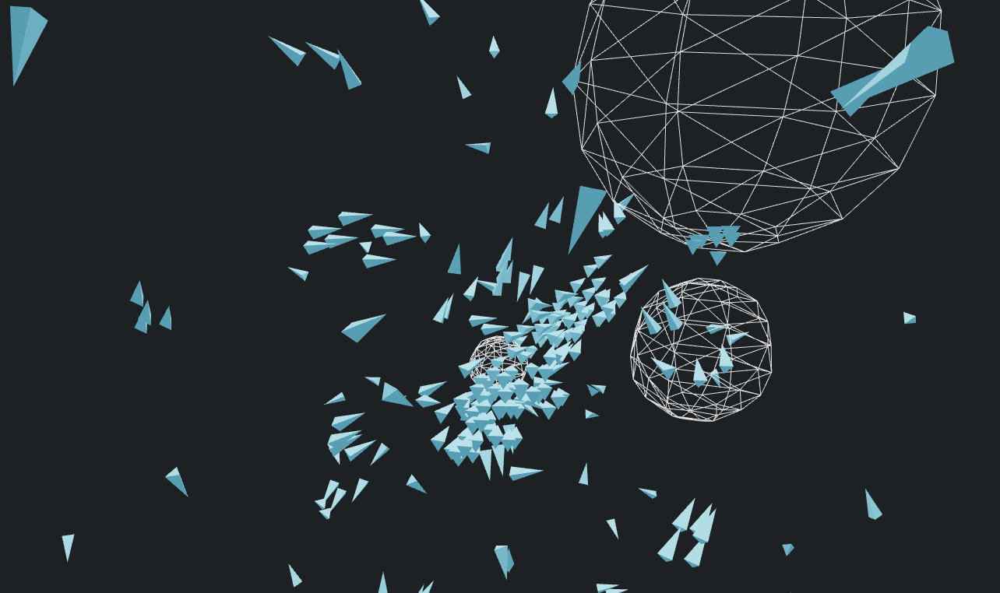

# useVehicles



A work in progress implementation of vehicle behaviours in React Three Fiber and TypeScript. Not yet a library....

# useVehicle

A React hook that implements simple vehicle behaviours.

```jsx
import { useVehicle } from "useVehicle"

const Wander = () => {
  const [vehicle, api] = useVehicle()

  useFrame(() => {
    const wanderForce = api.wander(20)
    api.applyForce(wanderForce)
  })

  return (
    <mesh ref={vehicle}>
      <cylinderBufferGeometry args={[0, 0.5, 2, 3]} />
      <meshPhongMaterial flatShading shininess={1} color='#5ADBFF' />
    </mesh>
  )
}
```

# useVehicles

A React hook that implements flocking behaviours.

```

```

# useRepeller

```

```

# Implemented behaviours

## Seek

```jsx
import { useVehicle } from "useVehicle"

const target = new THREE.Vector3(0, 0, 5)

const Seek = () => {
  const [vehicle, api] = useVehicle()

  useFrame(() => {
    const seek = api.seek(target)
    api.applyForce(seek)
  })

  return (
    <mesh ref={vehicle}>
      <cylinderBufferGeometry args={[0, 0.5, 2, 3]} />
      <meshPhongMaterial flatShading shininess={1} color='#5ADBFF' />
    </mesh>
  )
}
```

## Arrive

```jsx
import { useVehicle } from "useVehicle"

const target = new THREE.Vector3(0, 0, 5)

const Arrive = () => {
  const [vehicle, api] = useVehicle()

  useFrame(() => {
    const arrive = api.arrive(target)
    api.applyForce(arrive)
  })

  return (
    <mesh ref={vehicle}>
      <cylinderBufferGeometry args={[0, 0.5, 2, 3]} />
      <meshPhongMaterial flatShading shininess={1} color='#5ADBFF' />
    </mesh>
  )
}
```

## Wander

```jsx
import { useVehicle } from "useVehicle"

const Wander = () => {
  const [vehicle, api] = useVehicle()

  useFrame(() => {
    const wander = api.wander(20)
    api.applyForce(wander)
  })

  return (
    <mesh ref={vehicle}>
      <cylinderBufferGeometry args={[0, 0.5, 2, 3]} />
      <meshPhongMaterial flatShading shininess={1} color='#5ADBFF' />
    </mesh>
  )
}
```

## Flee

```jsx
import { useVehicle } from "useVehicle"

const target = new THREE.Vector3(0, 0, 5)

const Flee = () => {
  const [vehicle, api] = useVehicle()

  useFrame(() => {
    const flee = api.flee(20)
    api.applyForce(flee)
  })

  return (
    <mesh ref={vehicle}>
      <cylinderBufferGeometry args={[0, 0.5, 2, 3]} />
      <meshPhongMaterial flatShading shininess={1} color='#5ADBFF' />
    </mesh>
  )
}
```

## Pursue

```jsx
import { useVehicle } from "useVehicle"

const target = new THREE.Vector3(0, 0, 5)

const Pursue = () => {
  const [vehicle, api] = useVehicle()

  useFrame(() => {
    const pursue = api.pursue(target)
    api.applyForce(pursue)
  })

  return (
    <mesh ref={vehicle}>
      <cylinderBufferGeometry args={[0, 0.5, 2, 3]} />
      <meshPhongMaterial flatShading shininess={1} color='#5ADBFF' />
    </mesh>
  )
}
```

## Evade

```jsx
import { useVehicle } from "useVehicle"

const target = new THREE.Vector3(0, 0, 5)

const Pursue = () => {
  const [vehicle, api] = useVehicle()

  useFrame(() => {
    const pursue = api.evade(20)
    api.applyForce(pursue)
  })

  return (
    <mesh ref={vehicle}>
      <cylinderBufferGeometry args={[0, 0.5, 2, 3]} />
      <meshPhongMaterial flatShading shininess={1} color='#5ADBFF' />
    </mesh>
  )
}
```

# Inspiration

- https://www.youtube.com/watch?v=70MQ-FugwbI&list=PLRqwX-V7Uu6ZV4yEcW3uDwOgGXKUUsPOM&ab_channel=TheCodingTrain
